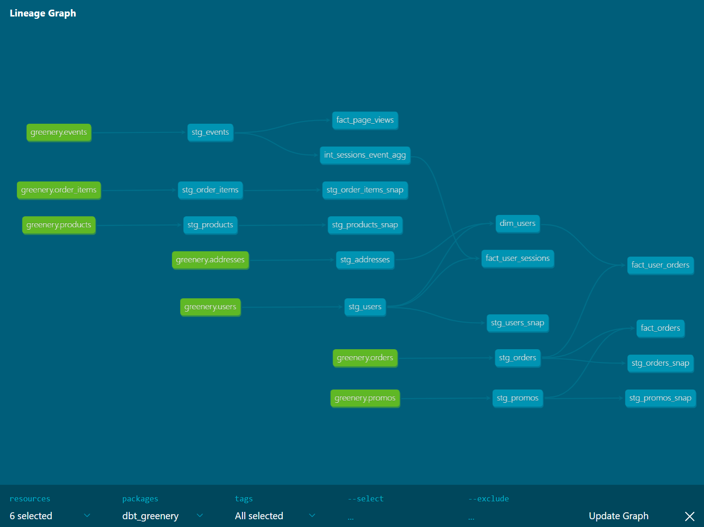

## Models

✅ **What is our user repeat rate?**  
*Repeat Rate = Users who purchased 2 or more times / users who purchased*

80.5%

sql at `analysis/project_answers/2_1_repeat_rate.sql`

✅ **What are good indicators of a user who will likely purchase again? What about indicators of users who are likely NOT to purchase again? If you had more data, what features would you want to look into to answer this question?**  
*NOTE: This is a hypothetical question vs. something we can analyze in our Greenery data set. Think about what exploratory analysis you would do to approach this question.*

RFM is a common retail analysis.

R = Recency  
F = Frequency  
M = Monetary  

Here is how IBM defines an [RFM analysis](https://www.ibm.com/docs/en/spss-statistics/SaaS?topic=marketing-rfm-analysis).

IBM defines Recency and Frequency in purely monetary terms. Time since last purchase. Frequency of purchases. I believe there are other valuable Recency / Frequency calculations - especially for new customers without an inital purchase. We should take a look at the Recency / Frequency of sessions and cart 

Recency and Frequency could be calculated for sessions and cart adds.

✅ **More stakeholders are coming to us for data, which is great! But we need to get some more models created before we can help. Create a marts folder, so we can organize our models, with the following subfolders for business units:**

* Core
* Marketing
* Product

**Within each marts folder, create at least 1-2 intermediate models and 1-2 dimension/fact models.**  

*Note: think about what metrics might be particularly useful for these business units, and build dbt models using greenery’s data*

* *For example, some “core” datasets could include fact_orders, dim_products, and dim_users*
* *The marketing mart could contain a model like “user_order_facts” which contains order information at the user level*
* *The product mart could contain a model like “fact_page_views” which contains all page view events from greenery’s events data*

✅ **Explain the marts models you added. Why did you organize the models in the way you did?**

For a full project this would require more thought. I followed the general guidance in the course.

✅ **Use the dbt docs to visualize your model DAGs to ensure the model layers make sense**  
*Paste in an image of your DAG from the docs*

## Tests

✅ **We added some more models and transformed some data! Now we need to make sure they’re accurately reflecting the data. Add dbt tests into your dbt project on your existing models from Week 1, and new models from the section above**

✅ **What assumptions are you making about each model? (i.e. why are you adding each test?)**

At a minumum each table job should have a uniqueness and not_null test on the grain of the table. This helps warn you if a new join accidentally fans out the data.

There are also categorical fields that we want to lock in. If a new category is introduced there is likely new business logic we need to take into consideration.

✅ **Did you find any “bad” data as you added and ran tests on your models? How did you go about either cleaning the data in the dbt model or adjusting your assumptions/tests?**  

Testing at the staging level provides a solid foundation to build from. 

I do not have any calculated fields yet to test.

Some assumptions:

- Users may only have one address
- Orders may only have one promo
- Promos were valid at the time they were applied to the order, even if their current status is inactive

✅ **Your stakeholders at Greenery want to understand the state of the data each day. Explain how you would ensure these tests are passing regularly and how you would alert stakeholders about bad data getting through.**

dbt jobs - including tests - can be run on a schedule using dbt Cloud. When using dbt Cloud any job failures can trigger alerts. Analytics Engineers can subscribe to job failures via email or the alert an be pushed into Slack.

dbt Cloud also exposes data freshness and test results that can be embedded in reports. Depending on Greenery's reporting tool will determine how deep the intergration goes. We coud review the documentation [here](https://docs.getdbt.com/docs/dbt-cloud/using-dbt-cloud/cloud-dashboard-status-tiles) and decide which is the best for us.